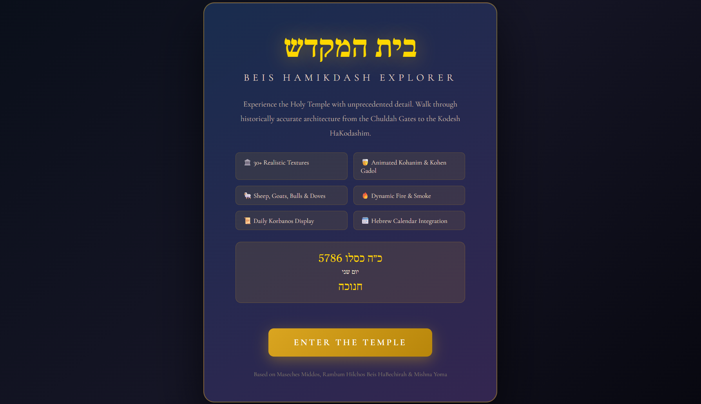
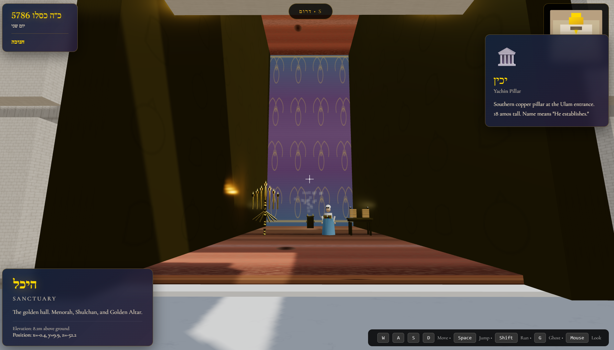
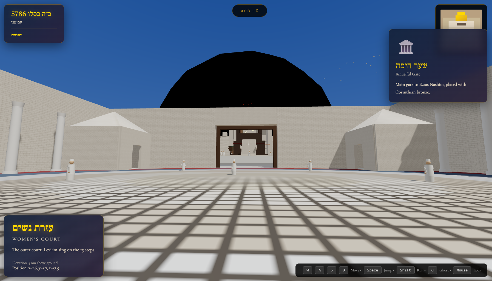

# בית המקדש — Beis Hamikdash 3D Explorer

An immersive first-person 3D walkthrough of the Holy Temple (Beis Hamikdash) in Jerusalem, featuring historically accurate architecture, holy vessels, animated characters, and educational information.



## Quick Start

```bash
# 1. Install dependencies
npm install

# 2. Run the app
npm run dev
```

Then open **http://localhost:5173** in your browser.

## Screenshots

| Azaras Kohanim | Heichal Interior | Ezras Nashim |
|----------------|------------------|--------------|
|  |  |  |

## Controls

| Key | Action |
|-----|--------|
| `W` / `↑` | Walk forward |
| `S` / `↓` | Walk backward |
| `A` / `←` | Strafe left |
| `D` / `→` | Strafe right |
| `Shift` | Run |
| `Space` | Jump |
| `G` | Toggle ghost/noclip mode |
| `Mouse` | Look around |
| `Click` | Capture mouse |
| `Esc` | Release mouse |

## Temple Areas

### Outer Courts
- **Har HaBayis** — Temple Mount platform with outer walls and Chuldah Gates
- **Ezras Nashim** — Women's Court with four corner chambers:
  - **Chamber of Oils** (לשכת השמנים) — Oil storage jars and vessels for the Menorah
  - **Chamber of Lepers** (לשכת המצורעים) — Mikvah for purification of healed metzora'im
  - **Chamber of Nazarites** (לשכת הנזירים) — Cooking area with fire, pots; Nazirite figure with long hair
  - **Chamber of Wood** (לשכת העצים) — Stacked wood piles, inspection table for checking worms

### Inner Courts (Azara)
- **Azaras Yisrael** — Court of Israelites (accessed via 15 steps from Ezras Nashim)
- **Duchan** — Platform where Levites sang during the Avodah
- **Azaras Kohanim** — Priests' Court containing:
  - Great Altar (Mizbeiach) with ramp (Kevesh)
  - Copper Laver (Kiyor)
  - Marble slaughter tables with sacrificial lambs (Korban Tamid)
  - Bronze slaughter rings (Taba'os)
  - Cedar hanging pillars with iron hooks
  - **Lishkas HaGazis** (Chamber of Hewn Stone) — Sanhedrin judges seated in semi-circle
  - **Beis HaMoked** (Chamber of the Hearth) — Fire pit with sleeping Kohanim on mats
- **Side Gates** — All 6 gates accessible via stone stairs from Har HaBayis level

### Heichal (Sanctuary)
- **Ulam** — Entrance Hall with:
  - Yachin and Boaz copper pillars (18 amos tall)
  - Decorative roof/portico over the entrance
- **Heichal** — Main Sanctuary containing:
  - Golden Menorah (7 branches, perpetually lit)
  - Showbread Table (Shulchan) with 12 loaves
  - Golden Incense Altar (Mizbeiach HaZahav)
- **Kodesh HaKodashim** — Holy of Holies containing:
  - Holy Ark (Aron) with golden Keruvim
  - Foundation Stone (Even HaShtiya)
  - Paroches (sacred curtain with embroidered Keruvim)

## Gates

### Main Gates
- **Chuldah Gates** — Southern entrance from the City of David (2 gates)
- **Beautiful Gate** (שער היפה) — Corinthian bronze entrance to Ezras Nashim
- **Nicanor Gate** — The great copper gate to the Azara (miraculously survived a storm at sea)

### Azara Side Gates (6 total, all accessible via stairs)
| West Side | East Side |
|-----------|-----------|
| Kindling Gate (שער הדלק) | Hearth Gate (שער בית המוקד) |
| Water Gate (שער המים) | Flame Gate (שער הניצוץ) |
| Gate of Firstlings (שער הבכורות) | Sacrifice Gate (שער הקרבן) |

## Features

- **Hebrew Date Display** — Shows current date in Hebrew calendar
- **Daily Korbanos** — Lists the day's required offerings based on date
- **Interactive Labels** — Walk near any vessel, gate, or chamber for historical information
- **Minimap** — Top-left corner navigation aid
- **Compass** — Directional orientation (North toward Kodesh HaKodashim)
- **Coordinate Display** — X-Y-Z position shown for navigation
- **Animated Characters**:
  - Kohanim in white robes throughout the courts
  - Sanhedrin judges in blue robes (Chamber of Hewn Stone)
  - Sleeping Kohanim (Beis HaMoked)
  - Nazirite with long hair (Chamber of Nazarites)
  - Sheep, goats, bulls, and doves
- **Sacrifice Animals** — Lambs on slaughter tables representing the daily Tamid
- **Ambient Effects** — Fire particles on altar, smoke from incense, divine glow in Kodesh HaKodashim

## Architecture

The codebase uses a modular builder pattern:

```
src/
├── game/
│   ├── TempleGame.js        # Main game controller & KEILIM labels
│   ├── TempleBuilder.js     # Orchestrates all builders
│   ├── PlayerController.js  # Movement and collision
│   ├── CharacterSystem.js   # Kohanim and animal spawning
│   ├── ParticleSystem.js    # Fire and smoke effects
│   └── builders/
│       ├── BaseBuilder.js       # Shared building utilities
│       ├── HarHaBayisBuilder.js # Temple Mount platform
│       ├── EzrasNashimBuilder.js# Women's Court & chambers
│       ├── AzaraBuilder.js      # Priests' Courts & chambers
│       ├── HeichalBuilder.js    # Sanctuary & Ulam
│       ├── KeilimBuilder.js     # Holy vessels
│       └── LightingBuilder.js   # Lights and atmosphere
├── utils/
│   ├── HebrewCalendar.js    # Hebrew date calculations
│   └── Korbanos.js          # Daily offering logic
└── App.jsx                  # React UI overlay
```

## Floor Elevations

| Area | Height (Y) |
|------|------------|
| Har HaBayis | 1.8 |
| Ezras Nashim | 3.8 |
| Azaras Yisrael | 6.8 |
| Duchan | 7.0 |
| Azaras Kohanim | 7.3 |
| Heichal | 8.3 |

## Sources

Dimensions and layout based on:
- Maseches Middos (Mishnah)
- Rambam, Hilchos Beis HaBechirah
- Maseches Yoma
- Maseches Tamid

## Tech Stack

- React 18
- Three.js (3D rendering)
- Vite (build tool)

## Contributing

Contributions welcome! Areas for improvement:
- Additional Keilim details and accuracy
- Sound effects (Levite singing, shofar)
- Time-of-day lighting changes (morning/afternoon Tamid)
- Festival-specific decorations (Sukkos, etc.)
- VR support

---

יְהִי רָצוֹן שֶׁיִּבָּנֶה בֵּית הַמִּקְדָּשׁ בִּמְהֵרָה בְיָמֵינוּ

*May the Beis Hamikdash be rebuilt speedily in our days*
